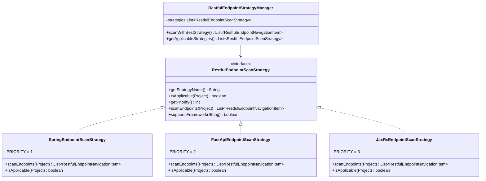
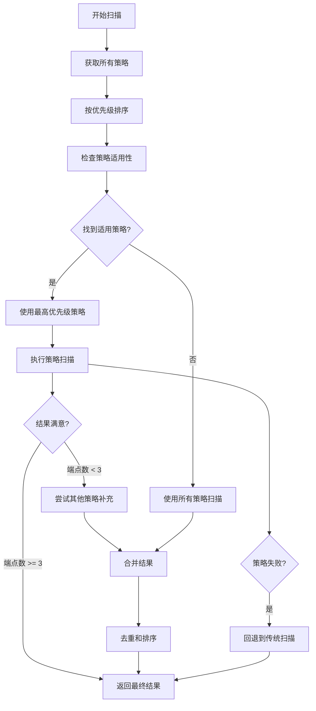

# RESTful 端点扫描策略模式实现

## 概述

本次重构采用了**策略模式（Strategy Pattern）**来实现多框架、多IDE环境下的RESTful端点扫描功能。这种设计模式使得系统能够根据不同的项目类型和IDE环境，自动选择最适合的扫描策略。

## 🎯 策略模式架构

### 核心组件



## 🔧 策略实现详解

### 1. Spring 框架策略（优先级：1）

**支持的IDE：** IntelliJ IDEA  
**支持的框架：** Spring Boot, Spring MVC  
**适用条件：**
- 项目中存在 Spring 依赖
- 发现 `@RestController` 或 `@Controller` 注解

**扫描逻辑：**
```java
// 1. 优先通过注解搜索
Collection<PsiClass> restControllers = findClassesByAnnotation("@RestController", scope);

// 2. 回退到文件扫描
if (!foundFromAnnotations || endpoints.size() < 3) {
    scanFromJavaFiles(project, endpoints);
}
```

**支持的注解：**
- `@RestController`
- `@Controller`
- `@RequestMapping`, `@GetMapping`, `@PostMapping`, `@PutMapping`, `@DeleteMapping`, `@PatchMapping`

### 2. FastAPI 框架策略（优先级：2）

**支持的IDE：** PyCharm  
**支持的框架：** FastAPI  
**适用条件：**
- 项目中存在 FastAPI 依赖（requirements.txt, pyproject.toml, Pipfile）
- Python 文件中包含 FastAPI 导入

**扫描逻辑：**
```python
# 识别 FastAPI 路由装饰器
@app.get("/users/{id}")
@router.post("/users")
@api.put("/users/{id}")
```

**支持的装饰器：**
- `app.get`, `app.post`, `app.put`, `app.delete`, `app.patch`
- `router.get`, `router.post`, `router.put`, `router.delete`, `router.patch`
- `api.get`, `api.post`, `api.put`, `api.delete`, `api.patch`

### 3. JAX-RS 框架策略（优先级：3）

**支持的IDE：** IntelliJ IDEA  
**支持的框架：** JAX-RS, Jersey, RESTEasy  
**适用条件：**
- 发现 `@Path` 注解
- 存在 JAX-RS 相关依赖

**支持的注解：**
- `@Path` (javax.ws.rs / jakarta.ws.rs)
- `@GET`, `@POST`, `@PUT`, `@DELETE`, `@PATCH`

## 🎯 策略选择流程



## 🚀 使用方式

### 基本使用
```java
// RestfulUrlService 会自动使用策略模式
RestfulUrlService service = new RestfulUrlService(project);
List<RestfulEndpointNavigationItem> endpoints = service.findAllRestfulEndpoints();
```

### 高级使用
```java
// 获取策略管理器进行更精细的控制
RestfulEndpointStrategyManager manager = service.getStrategyManager();

// 查看所有适用的策略
List<RestfulEndpointScanStrategy> strategies = manager.getApplicableStrategies();

// 使用特定框架的策略
List<RestfulEndpointScanStrategy> springStrategies = manager.getStrategiesByFramework("spring");

// 获取策略信息
List<StrategyInfo> info = manager.getAllStrategyInfo();
```

## 📊 性能优化

### 智能策略选择
1. **优先级排序**：按框架流行度和检测准确性排序
2. **适用性检查**：只运行适合当前项目的策略
3. **智能回退**：如果主策略结果不理想，自动尝试其他策略

### 缓存和优化
- **结果去重**：自动去除重复的端点
- **延迟加载**：策略只在需要时实例化
- **异常处理**：单个策略失败不影响其他策略

## 🔌 扩展新策略

### 1. 实现策略接口
```java
public class FlaskEndpointScanStrategy implements RestfulEndpointScanStrategy {
    @Override
    public String getStrategyName() {
        return "Flask";
    }
    
    @Override
    public boolean isApplicable(Project project) {
        // 检查是否为 Flask 项目
        return hasFlaskDependencies(project);
    }
    
    @Override
    public int getPriority() {
        return 4; // 设置优先级
    }
    
    @Override
    public List<RestfulEndpointNavigationItem> scanEndpoints(Project project) {
        // 实现 Flask 路由扫描逻辑
        return scanFlaskRoutes(project);
    }
    
    @Override
    public boolean supportsFramework(String frameworkName) {
        return "flask".equalsIgnoreCase(frameworkName);
    }
}
```

### 2. 注册策略
```java
// 在 RestfulEndpointStrategyManager.initializeStrategies() 中添加
strategyList.add(new FlaskEndpointScanStrategy());
```

## 🌟 支持的框架总览

| 框架 | IDE | 优先级 | 状态 | 注解/装饰器 |
|------|-----|--------|------|-------------|
| Spring Boot | IntelliJ IDEA | 1 | ✅ 完成 | @RestController, @GetMapping |
| Spring MVC | IntelliJ IDEA | 1 | ✅ 完成 | @Controller, @RequestMapping |
| FastAPI | PyCharm | 2 | ✅ 完成 | @app.get, @router.post |
| JAX-RS | IntelliJ IDEA | 3 | ✅ 完成 | @Path, @GET, @POST |
| Flask | PyCharm | 4 | 🔄 待实现 | @app.route |
| Django REST | PyCharm | 5 | 🔄 待实现 | ViewSet, APIView |
| Express.js | WebStorm | 6 | 🔄 待实现 | app.get, router.post |

## 🎛️ 配置选项

### 策略优先级调整
```java
// 可以通过继承或配置文件调整优先级
public class CustomSpringStrategy extends SpringEndpointScanStrategy {
    @Override
    public int getPriority() {
        return 0; // 最高优先级
    }
}
```

### 框架检测阈值
```java
// 调整回退条件
if (!foundFromPrimaryStrategy || endpoints.size() < THRESHOLD) {
    // THRESHOLD 可配置
    scanWithSecondaryStrategies();
}
```

## 🔍 调试和日志

策略模式包含详细的日志输出：

```
Strategy applicable: Spring
Using strategy: Spring
Found 15 endpoints with Spring
Primary strategy found few endpoints, trying secondary strategies
Scanning with strategy: JAX-RS
Found 3 endpoints with JAX-RS
Total endpoints found: 18
```

## 🏆 优势总结

1. **高扩展性**：轻松添加新框架支持
2. **智能选择**：自动选择最适合的扫描策略
3. **高性能**：避免不必要的扫描操作
4. **强容错性**：单个策略失败不影响整体功能
5. **多IDE支持**：同时支持 IntelliJ IDEA 和 PyCharm
6. **框架无关**：支持 Java 和 Python 等多种语言框架

这种策略模式的实现为插件提供了强大的扩展能力，使其能够适应不断变化的开发生态系统！